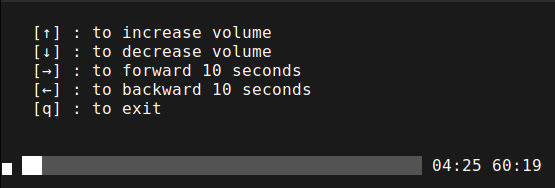

# Simple VLC Player

A simple VLC player for Linux written in go.





## Quick Start

### Go Install

```bash
go install -v github.com/adrian-lin-1-0-0/simple-vlc-player/cmd/simple-vlc-player@latest
```
And then run it.

```bash
simple-vlc-player -f <path-to-file>
```

### Source Code

```bash
go run cmd/simple-vlc-player/main.go -f <path-to-file>
```

## Install VLC On Debian/Ubuntu

```bash
sudo apt-get install libvlc-dev
sudo apt-get install vlc
```