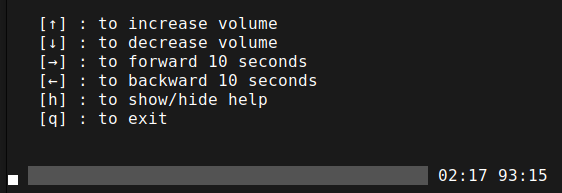

# Simple VLC Player

A simple VLC player for Linux written in go.

## Quick Start

```bash
go run ./*.go -f <path-to-file>
```



## Install VLC On Debian/Ubuntu

```bash
sudo apt-get install libvlc-dev
sudo apt-get install vlc
```